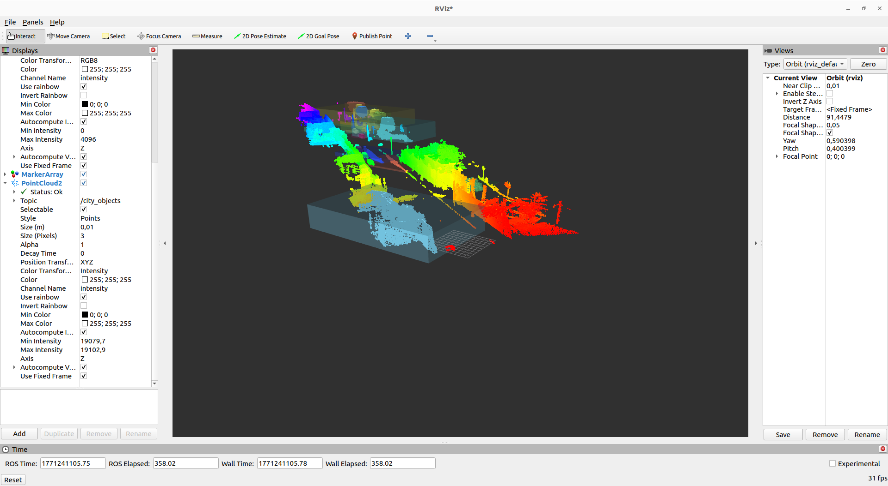

# City Analyzer ROS 2

A high-performance ROS 2 package for semantic analysis and segmentation of 3D urban point clouds (Lidar/PLY).

## Visualization

*Visualizing the segmented urban environment: Ground (green), Buildings/Obstacles (red), and Raw Cloud.*

## Features
- **Preprocessing**: Voxel Grid filtering to optimize RAM usage and processing speed.
- **Ground Segmentation**: Road plane extraction using the RANSAC algorithm.
- **Object Extraction**: Isolation of non-ground elements (buildings, vehicles, street furniture).
- **Real-time Optimization**: Asynchronous timers and QoS (Best Effort) policies for smooth visualization in RViz2.

## Project Structure
```text
city_analyzer_ros/
├── data/                  # PLY files (e.g., Lille_1.ply)
├── include/               # Header files (.hpp)
├── src/                   # C++ Source code (PCL & ROS 2)
├── launch/                # Launch scripts for automation
└── rviz/                  # Pre-configured RViz display settings
```
## Installation & Build

Prerequisites: Ubuntu 22.04 (Humble) or 20.04, ROS 2, and PCL Library.

Workspace Setup: Clone the repository into your ```~/ros2_ws/src``` folder.

Build: 
    ```colcon build --symlink-install```

Optimized Build : 
    ```colcon build --symlin-install --parallel-workers 2``` to save RAM.

Environment: Source the setup file after building with 
    ```source install/setup.bash```

## Run
Launch the node and RViz2 using :
        ```ros2 launch city_analyzer_ros city_visualizer.launch.py```

## Configuration
Fine-tune the processing thresholds in main.cpp or the launch file:

    -voxel_leaf_size: Downsampling resolution (default: 0.2m).

    -distance_threshold: RANSAC tolerance for plane detection (default: 0.15m).

    -cluster_tolerance: Distance between points to form a cluster (default: 0.5m).
